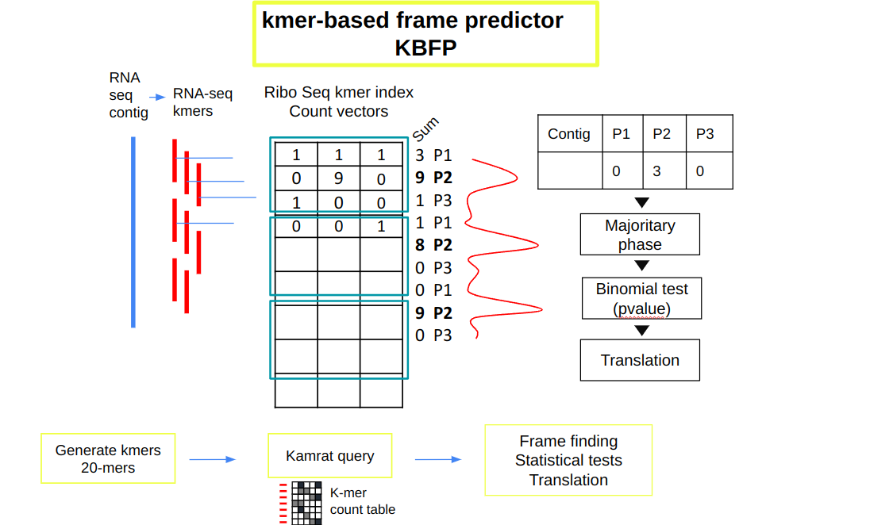

# Kmer-Based Frame Predictor (KBFP) - README

## Overview

**Kmer-Based Frame Predictor (KBFP)** is a bioinformatics protocol designed to analyze RNA sequences and determine their potential translation frames using ribo-seq data. The main goal is to query RNA sequences (neoRNAs) against a ribo-seq kmer index to determine if they are translated and identify the dominant translation frame. This process involves analyzing k-mers for each sequence and conducting a binomial test to assess translation phase significance.

## Prerequisites

Before running the KBFP protocol, make sure the following dependencies are installed
## Prerequisites

Before running the KBFP protocol, ensure the following dependencies are installed:

- **KaMRaT Image**: The protocol uses an image of KaMRaT. Make sure you have access to the KaMRaT Singularity or Docker image.
  
- **Python Libraries**:
  - `pandas`
  - `matplotlib`
  - `argparse`
  - `sys`
  - `re`
  - `matplotlib.pyplot`
  - `Pillow` (for `PIL.Image`)
  
- **Other Tools**:
  - **SeqKit**: SeqKit is a fast and versatile toolkit for processing FASTA and FASTQ sequences. It provides various utilities for format conversion, filtering, and sequence manipulation, which are essential for handling and preparing sequence data in this protocol.
  
    You can install SeqKit using Conda with the following command:
    
    ```bash
    conda install -c bioconda seqkit
    ```

## Protocol Workflow

This protocol takes neoRNA sequences as input and queries them against a ribo-seq kmer index. The steps are as follows:

1. **RNA k-mer Querying**: RNA sequences are divided into consecutive k-mers, shifted by one nucleotide each time to cover all three possible translation frames.
2. **Ribo-Seq Query**: Each k-mer is queried against a ribo-seq kmer index to retrieve count data.
3. **Summing Counts**: The counts for k-mers corresponding to each translation frame (P1, P2, P3) are summed to identify the frame with the highest translation activity.
4. **Frame Dominance**: The dominant frame is identified based on the highest sum of counts across all k-mers for each frame.
5. **Phasing and Translation**: A binomial test is conducted to determine whether the dominant frame is statistically significant (p-value < 0.05). If so, the contig is translated in this frame.
6. **Results**: The output includes the translated sequences, phase dominance statistics, p-values, and contig classification as phased (RS+P+) or not phased (RS+P-).

### Visual Representation of the Protocol



## Inputs

The input is a fasta file containing RNA sequences. Each contig (sequence) should have a unique identifier. Here is an example of the input fasta format:

```text
>cont_7
AAAAAAAAAAAAAAAAAAAAAGCAGCAGCACCTCATCCATTCAAGTTTGATCACGAGATTGAAGCAATTCAGTGACATCTTTAGGCTACACTTCTAAATCTAGCTCTCTTGCTATTTTCACCACATCTATAGTTGCTTCCTCCACTGAAGTCTCAAACCCCTCAAAGATTCATGAGGGCTGGAATCAGGTTTTTCCAAAATAC
>cont_40
AAAAAAAAAAAAAAAACCATGCATTGCTGCTTTTCCTACCACTTCCAGTAAGAAAATGGG
>cont_65
TGGGATTACAGGCACGTGCCACCACACCCAACTAATTTTTGTTTGTTTGTTTTTTTTTTTTTT
```
## Key Variables

- **Ribo-Seq Index**: The ribo-seq kmer index used for querying RNA sequences.
- **K-mer Length**: The default k-mer length is set to 20, but it can be adjusted according to the analysis.
- **Phase Shift**: The protocol supports adjusting the phase shift used in the analysis to account for reading frame changes.

## Output

The output consists of multiple files and plots summarizing the analysis. The main results include:

- **RS+P+**: Contigs found in the ribo-seq index with frame prediction validated by the binomial test (p-value < 0.05).
- **RS+P-**: Contigs found in the ribo-seq index but with frame prediction not validated by the binomial test (p-value > 0.05).
- **RS-**: Contigs not found in the ribo-seq index.

### Example of Output Table (generated by `run_KBFP.sh`):

| contig                          | ID_contig | P1 | P2 | P3 | DominantFrame | TranslatedSeq  | p_value | RSState |
|----------------------------------|-----------|----|----|----|---------------|----------------|---------|---------|
| CCCAGACGGCCCTGGCACTGAACTTCGGCTCT | cont_1    |  2 |  4 | 38 | 3             | QTALALNFGSTLM  | 0.0001  | RS+P+   |

### Example of Visual Output (generated by `post_process_kbfp.sh`):

The protocol generates plots showing the periodicity and dominant frames for each contig, helping to visualize the translation activity and frame dominance.

## Scripts

The KBFP protocol relies on several scripts that automate the querying, counting, and translation phases. Users must ensure that the correct paths to these scripts are provided in the configuration files. These scripts handle tasks such as:

- Generating k-mers from input sequences.
- Querying ribo-seq kmers.
- Performing phase counting and frame prediction.
- Translating RNA sequences into amino acids.
- Generating output plots.

## Important Notes

- **Configure Paths**: Ensure that all file paths (e.g., input fasta, kmer index, script locations) are properly set in the configuration files before running the pipeline.
- **Phase Shift**: You can adjust the phase shift parameter as required for your analysis (default is +1).
- **Script Locations**: All main scripts required for the protocol should be stored in the appropriate directories and their paths specified correctly in the main scripts.

## GitHub Repository

The full protocol, including all necessary scripts and examples, can be found in the GitHub repository.

You will find the two main scripts (`run_kbfp.sh` and `post_process_kbfp.sh`) along with other helper scripts in the repository.
